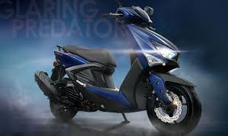

<html>
<head>
 <title></title>
 <link rel="stylesheet" type="text/css" href="body.css">
</head>
<body>
<h1 class="A" >資管一甲109306039謝旻辰 </h1>

 Cygnus於1984年發售。正式型號為XC125，引擎使用124cc排氣量，以圓弧曲線為設計特徵的車體外觀。雖然並不是一台很人氣的車種，但卻是販賣相當久的商品，1988年的小改款後，持續在日本市場販售了10年以上。

但1995年進行整個大改款，正式型號改為XC125T（台灣稱為迅光），到目前為止Cygnus全系列都是由台灣當地法人公司台灣山葉機車工業所生產，在日本則以代理的方式販售。外觀設計上增加更多的圓弧線條，銷售也有顯著的上升，以往大幅降價求售的情況已經很稀少了。

‘我愛勁戰

</body>
</html>
